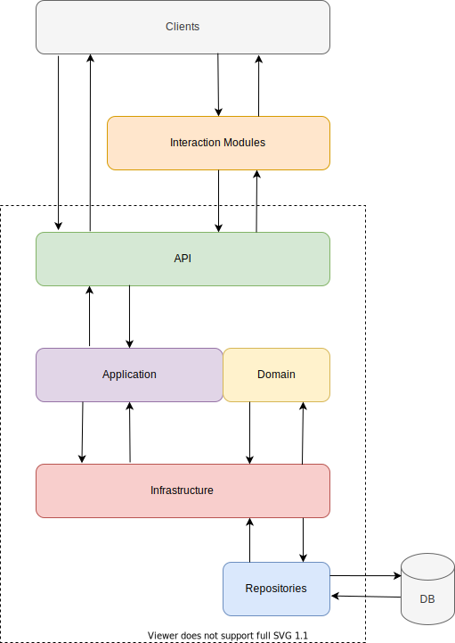

## Архитектура приложения

&nbsp;

В данной схеме Клиенты системы (Clients) отправляют заявки через WEB API приложения или через внешние системы
(Email, FTP, Telegram), модули взаимодействия с которыми расположены в слое InteractionModules.  
Модули взаимодействия представляют из себя отдельные приложения, которые:
- получают сообщения пользователей из внешних систем (Email, FTP, Telegram)
- извлекают данные заявок из пользовательских файлов (xlsx, xml, csv, json)
- формируют запросы на основе полученных
- отправляют запросы для создания заявок через WEB API приложения

Приложение разделено на несколько архитектурных уровней:
- Domain - содержит все сущности, перечисления, исключения, интерфейсы, типы и логику, специфичные для уровня домена.
- Application - содержит всю логику приложения. Он зависит от уровня домена, но не имеет зависимостей ни от какого другого уровня или проекта. Этот уровень определяет интерфейсы, которые реализуются внешними слоями.
- Infrastructure - содержит классы для доступа к внешним ресурсам (необходимых для реализации логики приложения) таким как файловые системы, веб-службы и так далее. Эти классы основаны на интерфейсах, определенных на прикладном уровне.
- API - Представляет собой WEB API приложения. Этот уровень зависит как от прикладного, так и от инфраструктурного уровней, однако зависимость от инфраструктуры предназначена только для поддержки внедрения зависимостей. Поэтому только Startup.cs должен ссылаться на инфраструктуру.